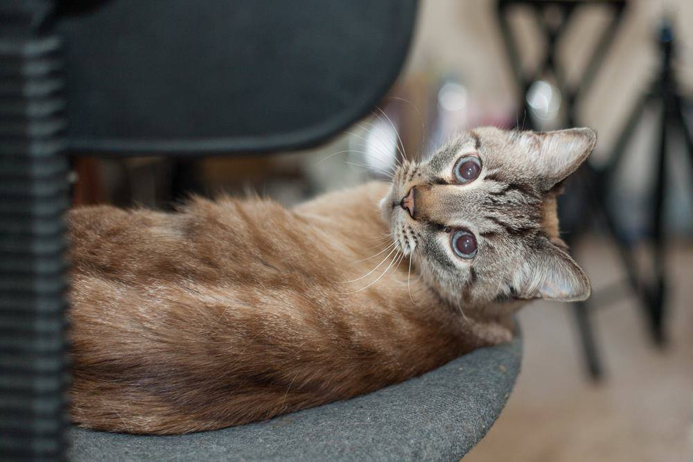

# I COULD LIVE (February 2nd, 2016)

 * Originally posted at https://www.facebook.com/oldmancat/photos/a.522599801246715.1073741828.519921494847879/529822010524494/

OLDMAN CAT: I COULD LIVE WITHOUT SO MUCH

SEK: I see you.

OLDMAN CAT: I COULD DIE WITHOUT A CLUE

SEK: Didn't realize you had one.

OLDMAN CAT: SUN KEEPS RISING IN THE WEST

SEK: Nope.

OLDMAN CAT: I KEEP ON WAKING FULLY CONFUSED

SEK: Point of agreement.

OLDMAN CAT: I NEVER SEEN NO MOUNTAIN

SEK: You sat in the window in Corona, you saw --

OLDMAN CAT: I NEVER SWAM NO SEA

SEK: You ever try to bathe you?

OLDMAN CAT: EVERY DAMN DAY SORRY I LOST MY PLACE

SEK: And that's my fault how?

OLDMAN CAT: DUN DUN DUN DUH DUH DUN DUH DUH DUH

SEK: You're not supposed to sing that part.

OLDMAN CAT: TRYING TO FIND MY PLACE SHUT UP DUN DUH DUH DUH DUN

SEK: Have at it.

OLDMAN CAT: I CAN'T LIVE WITHOUT YOUR TOUCH

SEK: You're on my lap.

OLDMAN CAT: I CAN'T LIVE WITHOUT YOUR TOUCH

SEK: Still on my lap.

OLDMAN CAT: I CAN'T LIVE WITHOUT YOUR TOUCH

SEK: This is going to get old quickly.

OLDMAN CAT: I CAN'T LIVE WITHOUT YOUR TOUCH

SEK: You know the song keeps going, right?

OLDMAN CAT: I CAN'T LIVE WITHOUT YOUR TOUCH

SEK: It has more words.

OLDMAN CAT: NOT IMPORTANT ONES

