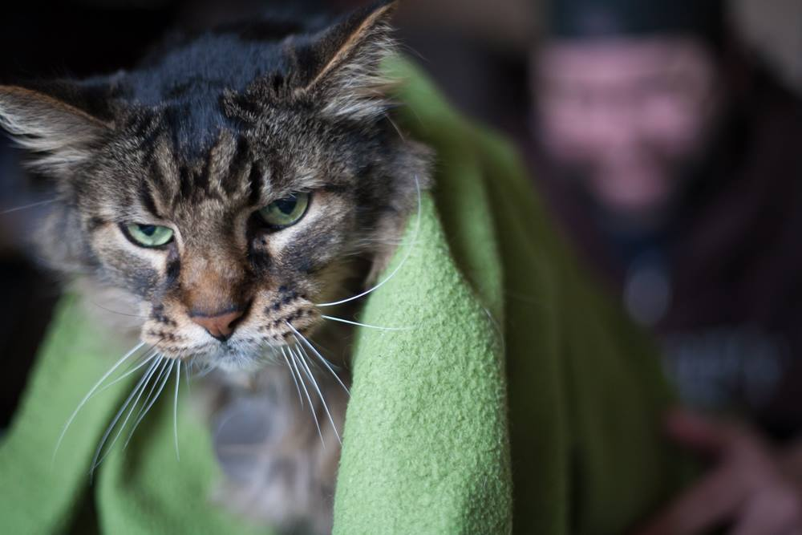

# THERE IS A PROBLEM (February 16th, 2016)

 * Originally posted at https://www.facebook.com/oldmancat/photos/a.522599801246715.1073741828.519921494847879/534707080035987/

OLDMAN CAT: THERE IS A PROBLEM

SEK: Yes?

OLDMAN CAT: FIX IT

SEK: I'd need to know what it is.

OLDMAN CAT: WHAT DO YOU THINK IT IS

SEK: I need to replace a light bulb?

OLDMAN CAT: NO

SEK: I need to clean out the litter box?

OLDMAN CAT: NO

SEK: The TV's too loud?

OLDMAN CAT: WELL YES ALWAYS BUT NO

SEK: So what is the problem?

OLDMAN CAT: WHAT DO YOU THINK IT IS

SEK: The humidity?

OLDMAN CAT: WARMER

SEK: It's too hot in here? Let me turn on the A/C.

OLDMAN CAT: MOTHERFUCKER

