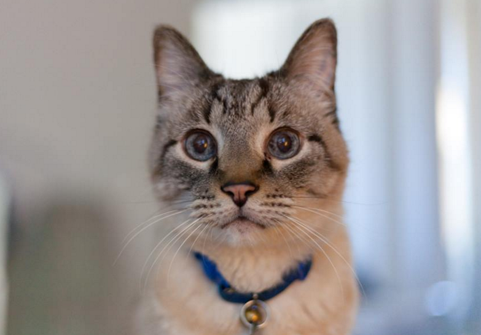

# HELLO (February 21st, 2016)

 * Originally posted at https://www.facebook.com/oldmancat/photos/a.522599801246715.1073741828.519921494847879/536277423212286/

OLDMAN CAT: HELLO

SEK: Hi!

OLDMAN CAT: HELLO

SEK: Howdy!

OLDMAN CAT: HELLO

SEK: Aloha!

OLDMAN CAT: HELLO

SEK: Shalom!

OLDMAN CAT: HELLO

SEK: Is there a correct answer to your implicit question?

OLDMAN CAT: I AM LONELY TIME TO CUDDLE

SEK: My shoulder's vacant at the moment.

OLDMAN CAT: COOL I'LL COME STICK MY EAR UP YOUR NOSE

SEK: Don't stick your ear up my nose.

OLDMAN CAT: WHY NOT IT'S WARM UP THERE

SEK: [SNEEZES VIOLENTLY]

OLDMAN CAT: YOU SPIT ON MY BRAIN

SEK: I did not!

OLDMAN CAT: ALL I WANTED WAS TO CUDDLE AND YOU SPIT ON MY BRAIN

SEK: No, all you wanted was to cuddle with my adenoids and I sneezed.

OLDMAN CAT: WHAT GIVES YOU THE RIGHT TO SPIT ON MY BRAIN

SEK: But the joke's on you because I don't even have any adenoids anymore!

OLDMAN CAT: NO NO JOKE IS ON YOU BECAUSE

SEK: Because why?

OLDMAN CAT: BOXES FULL OF CLOTHES THAT'S ALL I WILL SAY

SEK: Yes, that happens when moving.

OLDMAN CAT: BOXES FULL OF CLOTHES FOR ME TO PEE ON

SEK: So you DID have more to say I take it?

OLDMAN CAT: NO THAT'S ALL I'LL SAY

SEK: OK.

OLDMAN CAT: BUT I WOULD KEEP MY EYE ON THOSE CURTAINS

SEK: Why is that?

OLDMAN CAT: WOULD BE A SHAME IF SOMEONE CLAWED THEM

SEK: I take it that would be you?

OLDMAN CAT: YES IT WOULD WHY I AM TELLING YOU THIS

SEK: Because I spit on your brain, I bet.

OLDMAN CAT: GOD DAMN IT

