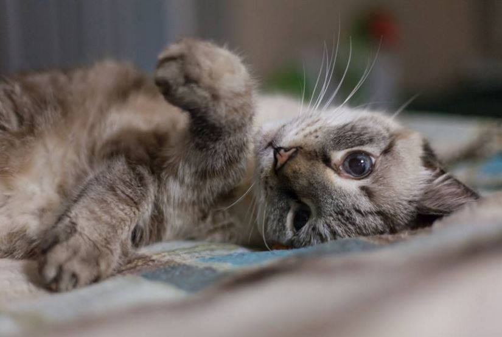

# DO YOU HEAR THAT (March 5th, 2016)

 * Originally posted at https://www.facebook.com/oldmancat/posts/540472452792783

OLDMAN VIRGIL: DO YOU HEAR THAT

SEK: Hear what?

OLDMAN VIRGIL: THE SKITTERING

SEK: I do not.

OLDMAN VIRGIL: IT IS COMING FROM THE PORCH

SEK: I'll investigate. You're safe, nerds, it's just a tiny --

OLDMAN MUND: HOLY FUCK IT'S A MOUSE RUN AWAY RUN AWAY

SEK: You did not just say that.

OLDMAN MUND: BATTLE STATIONS BATTLE STATIONS NEVER MIND RETREAT RETREAT

SEK: Are you serious?

OLDMAN MUND: ALL CATS COMMENCE SIDEWAYS HOPPING

OLDMAN VIRGIL: I WOULD BUT I'M TIRED GOOD NIGHT

SEK: What is wrong with you two?

OLDMAN MUND: TO THE HALLWAY IF YOU WANT TO LIVE

SEK: Do you even know what you are?

OLDMAN VIRGIL: NOT ASLEEP YET SHUT UP YOU TWO

OLDMAN MUND: THIS IS IT

SEK: It really isn't.

OLDMAN MUND: TELL THE OTHER MOMMA I LOVE HER WAIT WHERE DID THE MOUSE GO

SEK: I closed the door.

OLDMAN MUND: SO WHERE IS IT

SEK: Still outside, where it's always been.

OLDMAN MUND: WELL I SHOWED IT

SEK: Your true colors, you little chickenshit.

> Photograph courtesy of Megan Nowell Photography (2016)

